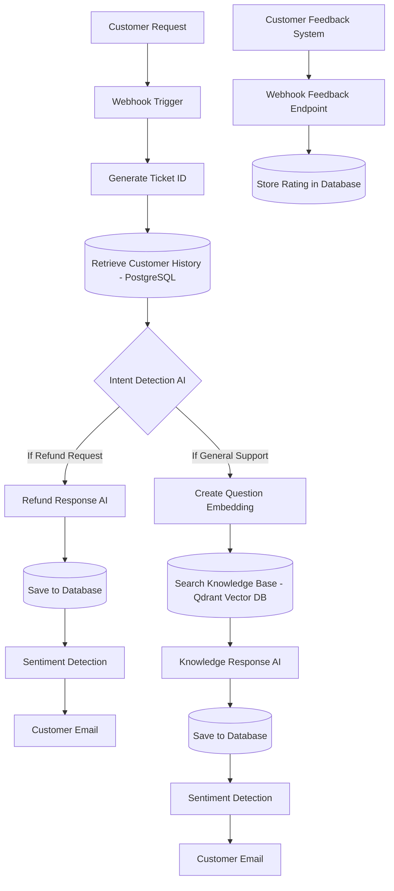

# 🤖 AI Customer Support Automation Platform

<!-- Badges -->


An **AI-powered customer support automation system** built using **n8n, OpenAI, Qdrant, and PostgreSQL**. 
The platform automatically processes customer requests, retrieves relevant knowledge using **RAG (Retrieval-Augmented Generation)**, analyzes sentiment, manages tickets, and sends intelligent responses via email.

This project demonstrates how modern AI systems can automate **customer support workflows** similar to real platforms like **Zendesk or Intercom**, while integrating **LLMs, vector search, and workflow automation**.

---

<details>
<summary><b>📖 Table of Contents</b> (Click to expand)</summary>

- [Project Overview](#-project-overview)
- [System Architecture](#-system-architecture)
- [Key Features](#-key-features)
- [Technologies Used](#-technologies-used)
- [Database Schema](#-database-schema)
- [Example Workflow](#-example-workflow)
- [Future Improvements](#-future-improvements)
- [Learning Outcomes](#-learning-outcomes)
- [Author & License](#-author--license)

</details>

---

## 🌟 Project Overview

Customer support teams receive a large number of repetitive requests such as password resets, refunds, or account issues. This platform automates most of these interactions using AI.

**When a customer sends a message:**
1. 🎟️ The system generates a **support ticket**
2. 🗄️ Retrieves **customer history from a database**
3. 🧠 Detects the **intent of the request**
4. 🔍 Searches a **vector knowledge base (RAG)** for relevant information
5. 🤖 Generates an **AI response**
6. 🎭 Detects the **customer's sentiment**
7. 📧 Sends an **email response**
8. 🚨 Alerts support staff if the customer is **angry**
9. 💾 Stores conversation history for **future context**
10. ⭐ Collects **customer satisfaction feedback**

---

## 🏗️ System Architecture



---

## ✨ Key Features

### 1. 💬 AI Customer Support Automation
Automatically answers customer queries using a Large Language Model.

<details>
<summary><b>Supported queries include:</b></summary>
<ul>
  <li>Password reset help</li>
  <li>Refund policy questions</li>
  <li>Shipping information</li>
  <li>Account management</li>
  <li>Subscription cancellation</li>
  <li>Payment issues</li>
</ul>
</details>

### 2. 🎟️ Ticket Management System
Each support request generates a unique ticket ID.
> **Example:** `SUP-2026-8408`

This allows support teams to track and reference conversations. Stored information includes Ticket ID, Customer email, Customer name, Customer message, AI response, and Timestamp.

### 3. 🕰️ Customer History Awareness
Before responding, the system checks previous interactions from the database to understand past issues, repeated problems, and customer frustration patterns.

```sql
SELECT message, ai_response
FROM support_requests
WHERE customer_email = ?
ORDER BY created_at DESC
LIMIT 5;
```

### 4. 📚 RAG Knowledge Base (Vector Search)
The system uses **Retrieval-Augmented Generation (RAG)** to answer questions using internal company knowledge (e.g., Refund policy, Shipping policy, Password reset instructions).

**Workflow:**
`Customer Question` ➡️ `Generate Embedding` ➡️ `Search Vector Database (Qdrant)` ➡️ `Retrieve relevant knowledge` ➡️ `Generate AI response`

### 5. 🔍 Vector Database (Qdrant)
Stores support knowledge as **vector embeddings** in Qdrant, allowing semantic search instead of keyword matching.
> **Customer:** "How can I change my password?"<br>
> **Retrieved knowledge:** "Password Reset: Go to the login page and click 'Forgot Password'."

### 6. 📄 Multi-Document Knowledge Base
Multiple knowledge documents are stored and embedded individually (Refund Policy, Shipping Policy, Password Reset Guide, etc.). This allows the AI to respond accurately to different types of support requests.

### 7. 🎭 Sentiment Detection
After generating a response, the system analyzes customer sentiment (`Positive`, `Neutral`, `Negative`). If sentiment is negative, the workflow triggers an alert system.

### 8. 🚨 Angry Customer Alert System
When the system detects negative sentiment, it sends an alert email to the support team and flags the ticket for priority. 
> **Trigger:** "Your service is terrible and I want a refund!"<br>
> **Action:** Alert email to support team + Priority flag for the ticket.

### 9. 📧 Automated Email Responses
Sends professional AI-generated emails to customers.
> **Subject:** Support Ticket SUP-2026-8408<br>
> **Dear Customer,**<br>
> Thank you for contacting support. To reset your password, please go to the login page and click "Forgot Password". Follow the instructions sent to your email...<br>
> **Best regards, AI Support Team**

### 10. ⭐ Customer Satisfaction Feedback System
Each support email includes interactive feedback links:
```text
Was this helpful? 
👍 Yes | 👎 No
```
> Example link: `/webhook/customer-feedback?ticket_id=SUP-2026-6295&rating=good`

Feedback is stored in the database to measure **AI support performance**.

| ticket_id     | rating | created_at |
| ------------- | ------ | ---------- |
| SUP-2026-6295 | good   | 2026-03-10 |

---

## 🛠️ Technologies Used

- **Automation Platform:** n8n
- **AI Models:** OpenAI API
- **Vector Database:** Qdrant
- **Database:** PostgreSQL
- **Containerization:** Docker
- **Programming:** JavaScript (n8n Code Nodes)
- **Architecture:** Retrieval Augmented Generation (RAG)

---

## 🗄️ Database Schema

<details>
<summary><b>Support Requests Table</b></summary>

```sql
ticket_id
customer_email
customer_name
message
ai_response
created_at
```
</details>

<details>
<summary><b>Customer Feedback Table</b></summary>

```sql
ticket_id
rating
feedback
created_at
```
</details>

---

## 🔄 Example Workflow

1. 📥 **Customer sends support request**
2. 🪝 **Webhook receives request**
3. 🆔 **Ticket ID generated**
4. 📂 **Customer history retrieved**
5. 🧠 **AI detects request intent**
6. 🔍 **Knowledge base search executed**
7. 🤖 **AI generates response**
8. 🎭 **Sentiment analysis performed**
9. 📧 **Response email sent**
10. ⭐ **Feedback collected**

---

## 🚀 Future Improvements

- **📊 AI Analytics Dashboard (Grafana):** Metrics on tickets per day, angry customers, average satisfaction score, and most common issues.
- **📥 Automatic Knowledge Loader:** Ingest knowledge directly from PDFs, Website FAQs, Notion docs, and Google Docs.
- **🔔 Slack/Discord Support Alerts:** Real-time notifications for critical support issues.

---

## 🎓 Learning Outcomes

This project demonstrates practical experience with:
- `AI System Architecture`
- `Vector Search and Embeddings`
- `Retrieval-Augmented Generation (RAG)`
- `Workflow Automation`
- `Database Integration`
- `Customer Support Automation`

---

## 👨‍💻 Author

**A.L. Supun Tharaka**  
*AI / Automation Engineering Projects*

## 📜 License
This project is open source for educational and research purposes.
